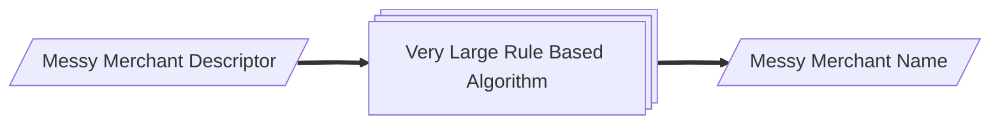
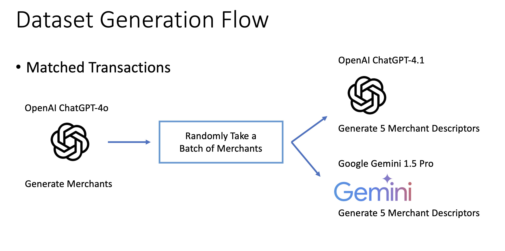
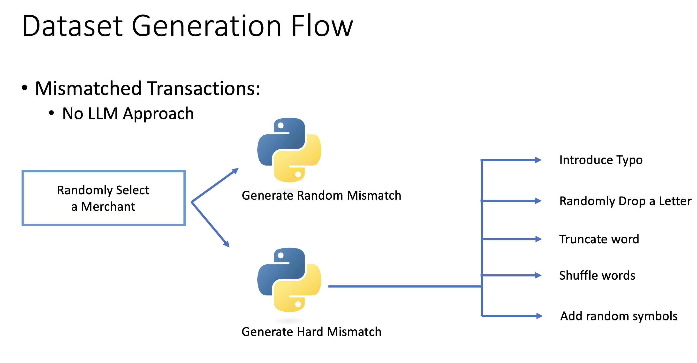

# LLMs for Matching Transaction Descriptors to Merchants
Submitted by: Rishabh (Rish) Kaushick <br>
Program: Master of Science in Information Systems <br>
Course: CSYE 7230 - Software Engineering & Generative Artificial Intelligence <br>
Term: Spring 2025 <br>
Supervised by: Prof. Junwei Huang

# Problem Statement
There are millions of credit card transactions that take place every hour, and billions of transactions every year \[4\]. Each time we swipe our card a messy merchant descriptor gets allocated for the corresponding transaction. Large financial organizations like MasterCard or Visa have a difficulty correctly matching these transaction merchant descriptors to merchant names. Consider the examples in the following table:

Take the following examples:

| Messy Merchant Descriptor    | Messy Merchant Name      | Label       |
|------------------------------|--------------------------|-------------|
| AMZN Mktp CA*UC33G8423       | Amazon Marketplace Canada| ✅ MATCH    | 
| NETFLX#999-USA               | NetFlex Gym USA          | 🚫 MISMATCH |   

Based on the current process (as shown in the Figure 1 below), sometimes the transaction merchant descriptors are mapped to the correct merchant names like in the first Amazon example. This is known as a ‘Match’. However, for the second transaction, which belongs to Netflix USA, has been incorrectly matched to ‘NetFlex Gym USA’, therefore being classified as a ‘Mismatch’.

## Current Process


Figure 1: Flow chart of the current process.


Sometimes the very large rule-based algorithm could correctly guess the merchant name from the merchant descriptor - like the Amazon example above. However, sometimes it could make mistakes such as the second example.

Therefore, given a pair of merchant descriptor and merchant name, can we classify whether the current process correctly identified the merchant? (MATCH condition) Or is it possible that it guessed the merchant wrongly? (MISMATCH)

Apart from traditional machine learning approaches, this project seeks to explore whether LLMs, with their emergent abilities, can solve this classification problem better.

# Dataset
Since the dataset for this project is confidential, other ways to generate a synthetic dataset, like using LLMs, have been explored. The objective of this project is to use LLMs to classify whether the descriptors match the merchants. If we use the same LLMs to generate the data and perform classification, it could potentially have a lot of bias. To solve this, creative approaches had to be followed to create synthetic data which was like real-world data:
1. The LLMs which generate the data will be different from the LLMs which perform the classification task.
2. Industry standard, cloud-based LLMs are used to generate the data. Smaller open source, open weights local models are used to perform the classification. Such LLMs are used to perform classification as no financial sensitive data will be needed to be sent to the servers of large organizations hosting their LLMs on the cloud.
3. The data generation & classification LLMs are as follows:
   - **Data Generation LLMs**: OpenAI ChatGPT-4o, ChatGPT-4.1, Gemini 1.5 Pro
   - **Data Classification LLMs**: Google Gemma 3, Meta Llama 3.2
The figure below shows a flowchart of the data generation pipeline.
<br>


Figure 2: Data generation flow for matched transactions


Figure 3: Data generation flow for ‘Mismatch’ transactions using Python.

# How to Run The Project
## Setup OpenAI API Key & Google Gemini API Key
First let's setup the API key in our environment variable from the terminal.

### MacOS Setup
1. Run the following (after changing YourAPIKeyHere):
    ```bash
    echo "export OPENAI_API_KEY='YourAPIKeyHere'" >> ~/.zshrc
    echo "export GEMINI_API_KEY='YourAPIKeyHere'" >> ~/.zshrc
    ```
2. Update the shell
    ```bash
    source ~/.zshrc
    ```
3. To confirm the API Key has been setup correctly, we can check it on the terminal as follows:
    ```bash
    echo $OPENAI_API_KEY
    echo $GEMINI_API_KEY
    ```

## Install Dependencies

### Python Dependencies
1. Install python (3.x)
2. Install dependencies from requirements.txt (Coming soon)

### SearXNG
This project uses [SearXNG-Docker](https://github.com/searxng/searxng-docker/) for retrieving web context about merchants.
1. [Install docker](https://docs.docker.com/install/)
2. Clone the SearXNG-Docker GitHub repo
    ```bash
    git clone https://github.com/searxng/searxng-docker.git
    cd searxng-docker
    ```
3. Edit the .env file and set hostname and remove the comment from the lines:
    ```
    SEARXNG_HOSTNAME=localhost:8080
    SEARXNG_UWSGI_WORKERS=4
    SEARXNG_UWSGI_THREADS=4
    ```
4. Generate the secret key ```sed -i "s|ultrasecretkey|$(openssl rand -hex 32)|g" searxng/settings.yml```. On a Mac: ```sed -i '' "s|ultrasecretkey|$(openssl rand -hex 32)|g" searxng/settings.yml```.
5. Edit searxng/settings.yml and update the following:
    ```yml
    server:
        limiter: false
    general:
        debug: true
    search:
        safe_search: 0
        language: "en"
        formats:
            - "json"
            - "html"
    ui:
    static_use_hash: true
    ```

> [!NOTE]
> On the first run, you must remove `cap_drop: - ALL` from the `docker-compose.yaml` file for the `searxng` service to successfully create `/etc/searxng/uwsgi.ini`. This is necessary because the `cap_drop: - ALL` directive removes all capabilities, including those required for the creation of the `uwsgi.ini` file. After the first run, you should re-add `cap_drop: - ALL` to the `docker-compose.yaml` file for security reasons.

6. Run SearXNG in the background:
    ```bash
    docker compose up -d
    ```